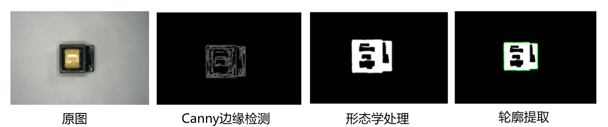

# SIPIT-2023
This system applies traditional image-processing methods—color thresholding, Gaussian blur, Canny edge detection, rectangular bounding, template matching based on shape features and SIFT, and pose estimation used on transformer images and integrates all functionalities into a single platform.

## Acknowledgment

This project is based on [wxFormBuilder](https://github.com/wxFormBuilder/wxFormBuilder). The camera parameters were pre-calibrated using Zhang Zhengyou’s method. The dataset was collected by myself and, due to a non-disclosure agreement with a certain company, is not publicly available.

## Introduction

* **Environment Setup:**
```bash
conda create -n SIPIT
conda activate SIPIT
```

* **Install**
```bash
git clone https://github.com/Shuanglin-1126/SIPIT-2023.git
cd SIPIT-2023
pip install requirements.txt
```

* **Detection of transformers**

<p align="center">
  
</p>

```bash
python recognition_detection/image_detection.py
```

* **Recognition of transformers**

<p align="center">
  
</p>
<p align="center">
  
</p>

```bash
python recognition_detection/match_template.py
```

* **Mask based on color**

<p align="center">
  
</p>

```bash
python mask_color/xisuhe.py
```

* **GUI show**

<p align="center">
  
</p>

```bash
python GUI/image_select.py
```
